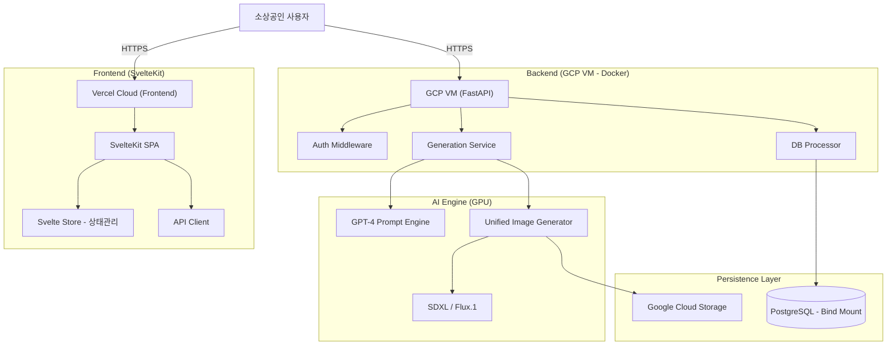

# 시스템 아키텍처 설계서 (SvelteKit + FastAPI)

## 1. 개요
본 시스템은 소상공인이 광고 이미지와 문구를 생성할 수 있는 웹 기반 서비스이다. 
사용자 인터페이스(Frontend)는 SvelteKit을 통해 Vercel에 배포되며, 
비즈니스 로직 및 AI 모델(Backend)은 GCP VM에서 Docker 컨테이너 환경으로 구동된다.

## 2. 시스템 구성도

## 3. 계층별 상세 역할
### 3.1 Frontend (SvelteKit)
배포: Vercel (자동 배포 및 SSL 적용)

상태 관리: Svelte 고유의 writable stores를 사용하여 채팅 내역 및 로그인 상태 관리.

특징: Streamlit보다 자유로운 UI 배치가 가능하며, 컴파일 기반 프레임워크로 속도가 매우 빠름.

### 3.2 Backend (FastAPI)
배포: GCP VM 내 Docker 컨테이너.

역할: API 엔드포인트 제공, JWT 인증, AI 모델 호출 스케줄링.

보안: Vercel 도메인에 대한 CORS 허용 설정 필수.

### 3.3 Data Storage
Database: PostgreSQL (VM 내 /data/db 폴더에 바인드 마운트하여 영구 저장).

Files: 생성된 이미지는 Google Cloud Storage(GCS)에 저장하고 DB에는 URL만 기록.

## 4. 데이터 흐름 (Data Flow)
1. 사용자 요청: Svelte 앱에서 광고 요청 텍스트 입력.
2. API 전달: JWT 토큰과 함께 FastAPI의 /generate 엔드포인트로 데이터 전송.
3. AI 처리: GPT-4로 프롬프트 최적화 후, GPU를 통해 이미지 생성.
4. 결과 반환: 생성된 이미지 URL과 광고 문구를 JSON으로 반환.
5. 화면 갱신: Svelte 스토어가 업데이트되며 채팅창에 즉시 생성 결과 렌더링.