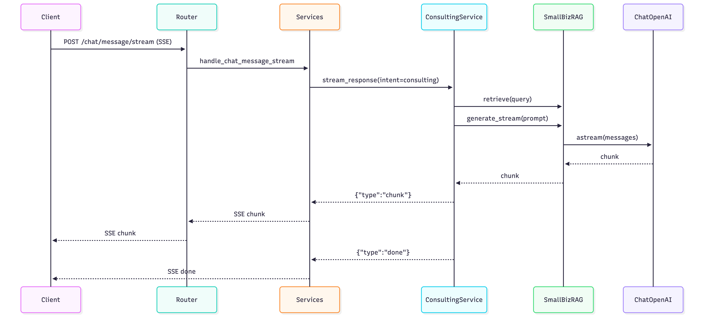

# 상담 챗봇 아키텍처 (RAG 연결)

이 문서는 **상담(consulting) 경로를 `chat_bot` 폴더의 RAG 로직으로 교체한 구조**와
서버 시작 시 **벡터스토어/임베딩 모델 프리로드 흐름**을 설명합니다.

## 1) 구성 요소

- **API 라우터**
  - `src/backend/routers/chat.py`
- **메시지 처리 서비스**
  - `src/backend/services.py` (`handle_chat_message_stream`)
- **상담 서비스 (RAG 연결)**
  - `src/backend/chatbot.py` (`ConsultingService`)
- **RAG 코어**
  - `src/generation/chat_bot/rag/chain.py` (`SmallBizRAG`, `generate_stream`)
  - `src/generation/chat_bot/rag/prompts.py` (`PromptBuilder`, `IntentRouter`, `SlotChecker`)
- **RAG 프리로드**
  - `src/backend/rag_preload.py`
  - `main.py` (lifespan)
- **벡터스토어**
  - `src/generation/chat_bot/data/vectorstore/chroma_db/`

## 2) 데이터 흐름

### 2-1) 상담 요청 흐름

### 2-2) 서버 시작 프리로드 흐름

## 3) 스트리밍 시퀀스

## 4) 핵심 구현 포인트

- **상담 응답 스트리밍**
  - `src/backend/chatbot.py`에서 `ConsultingService._stream_consulting_answer()`가
    `SmallBizRAG.generate_stream()`를 호출하여 chunk 단위로 SSE 전송.
- **슬롯 기반 필터링**
  - 최근 대화에서 업종/지역을 추출해 RAG 검색 필터로 적용.
- **RAG 스트리밍**
  - `src/generation/chat_bot/rag/chain.py`의 `SmallBizRAG.generate_stream()`이
    `ChatOpenAI.astream()`을 사용하며, 미지원 시 단일 응답으로 폴백.
- **의도 분기**
  - `src/backend/services.py`에서 intent가 `consulting`일 때 상담 경로로 분기.
- **프리로드**
  - 서버 시작 시 `start_rag_preload()`로 벡터스토어/임베딩 모델을 백그라운드 로드.

## 5) 환경 변수

`.env` 또는 실행 환경에 아래 값이 필요합니다.

- `OPENAI_API_KEY`
- `LLM_MODEL` (예: `gpt-4o`)
- `TAVILY_API_KEY` (Agent 사용 시)

`run.sh`는 `.env`를 자동 로드합니다.

## 6) 운영 체크리스트

- 벡터스토어 존재 여부 확인:
  - `src/generation/chat_bot/data/vectorstore/chroma_db/`
- 서버 시작 시 `[RAG Preload]` 로그 확인
- 상담 호출 시 로그에 "벡터스토어 로드 중..." 문구 확인
- SSE 응답이 **여러 chunk**로 도착하는지 확인

---

### 참고 파일

- `src/backend/chatbot.py`
- `src/backend/services.py`
- `src/generation/chat_bot/rag/chain.py`
- `src/generation/chat_bot/rag/prompts.py`
- `src/backend/rag_preload.py`
